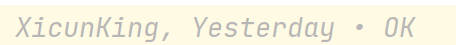

### 2021年，想要成为什么样的人

- 成为一个极客，针对Python或者大数据处理非常精通
- 可以在网络公开讨论和分享一些技巧、甚至工具，能够对互联网的开源世界做出一点小小的贡献
- 能够开发出工具，并共享到网络上，供大家使用
- 针对未来的科技和财经发展有自己的看法，并且付诸实践
- 针对生活有乐趣，能够找到生活的乐趣，每天都积极向上，健康乐观正向
- 与朋友愉快交往，能够一起分享和交流故事，通过朋友的眼睛看待这个世界
- 融入网络社会，成为观点的发源地和表达者，站在世界的前面
- 创新者

